# RPSLS-showdown

RPSLS-showdown is an in browser rock paper scissors like game with 5 options instead of the usual 3.

This website targets users who are looking for a fun quick game of rock paper scissors lizard spock.

The goal of RPSLS-showdown is to entertain the user and keep them engaged with the website. The website also contains information as to the origin of rock paper scissors lizard spock and of course, explains the rules of the game.

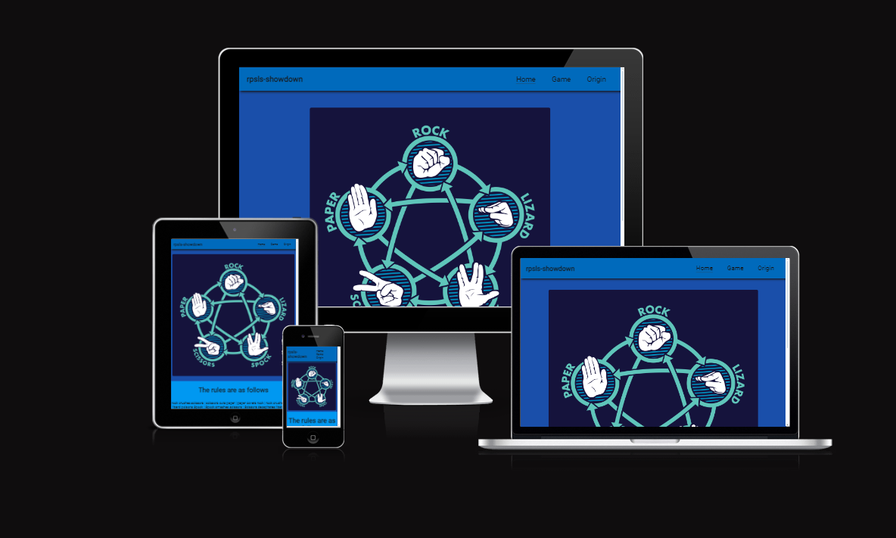

[View rpsls-showdown project here](https://rasm1.github.io/RPSLS-showdown/index.html)

## User Experience (UX)

This website is meant to attract people who are looking for a fun interactive game of rock paper scissors lizard spock.

The information is structured in such a way that the game can easily be navigated to and the rules are eplained first.

### User Stories

#### First-time visitor goals
<ul>
			<li>Understand the main purpose of the site and to easily navigate to the game.</li>
			<li>Clearly find out what the rules of the game are.</li>
			<li>To find out what the origin of the game is.</li>
</ul>

#### Returning visitor goals
<ul>		
			<li>Be engaged with the game itself</li>
			<li>To clearly understand the origin of the game.</li>
</ul>

#### Frequent user Goals
<ul>		
			<li>To stay engaged with the game.</li>
			<li>To clearly understand the origin of the game.</li>
</ul>

## Features

<ul>   
	 <li>The website contains a navigation bar to easily navigate through the diffrent pages</li>
	 <li>An image displaying the rules of the game along with written text. </li>
	 <li>A game page which leads to the game itself with buttons that implicitly show what option they are for.</li>
	 <li>A page dedicated to explaining the origin of the game along with a link to visually show where it was popularized.</li>
	 <li>Responsive on all device sizes.</li>
</ul>

### Existing Features

#### Navigation Bar
<ul>   
	<li>It is featured and fixed on all three pages.</li>
	<li>Includes links to the home page, game page and origins page and is identical in each page to allow for easy navigation.</li>
	<li>This navigation bar will allow the user to easily navigate from page to page across all devices without having to use the 'back button' to go to the previous page.</li>
	<li>To optimize screen usage, on smaller screens the navigation bar collapses into a smaller version retaining it's ease of use.</li>	
</ul>

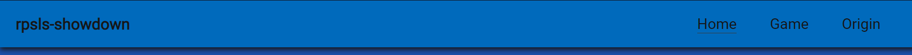

#### Landing Page Image  
<ul>
		<li>The landing page includes an image which shows the rules of how to game works.</li>
		<li>It is an intuitive way to show the rules of the game in a visual format</li>
 </ul>

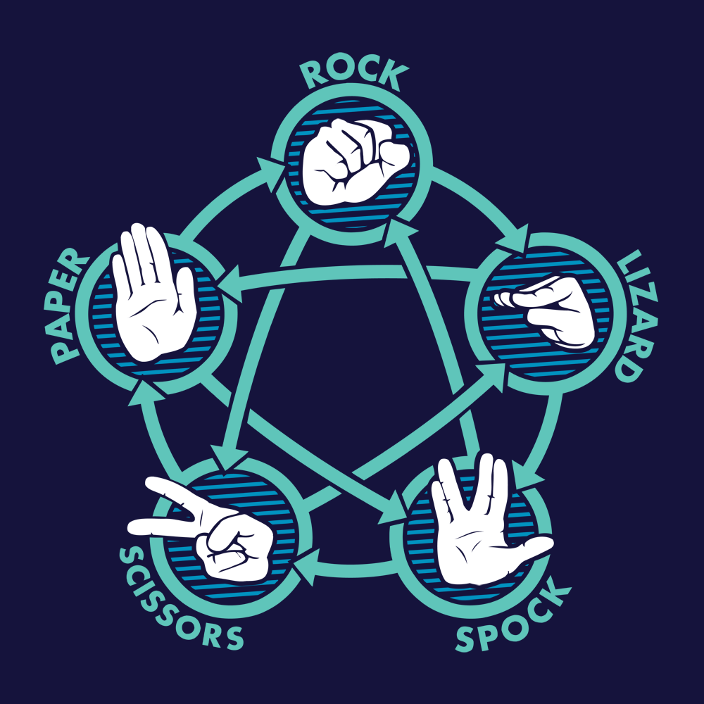

#### Rules and play button Section
<ul>
		<li>This section summarises the rules of the game in written format</li>
		<li>It is valuable to have the rules of the game written out in a concise way along with the visual explenation</li>
		</li>Underneath the rules you can find a let's play button which prompts the user to click on it to be redirected to the game page</li>
		<li>The play button is a fun and interesting way to prompt the user to start playing the game</li>
</ul>

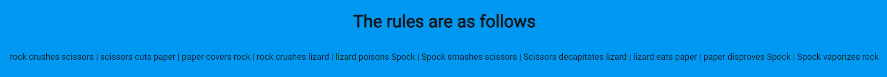
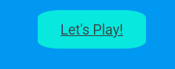

#### Game page
<ul>
		<li>This page is where the rock paper scissors lizard spock game can be played. </li>
		<li>The user can pick from 5 options which will be put up against a randomized choice by the computer </li>
        <li>The user will see what they picked, what the computer picked, if they won and what their score is compared to the computer</li>
		<li>The game is won or lost once one of the 2 participants reaches 10 wins</li>
</ul>

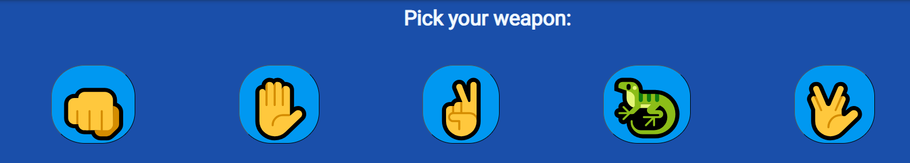
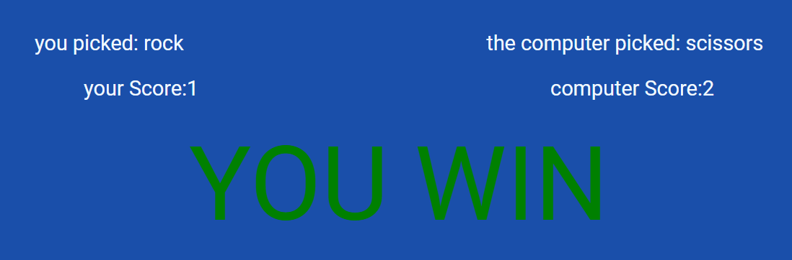
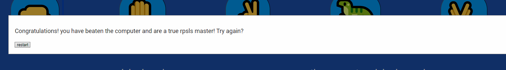

#### Origin page
<ul>
	<li>On this page the user learns who made the game and who popularized it. </li>
    <li>The page also contains a link to a youtube video that shows how the game was popularized.</li>
</ul>		

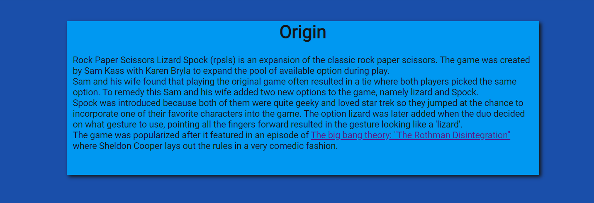

## Design

### Color Scheme
<ul>
    <li>Primary colors used on this website:</li>
</ul>           

 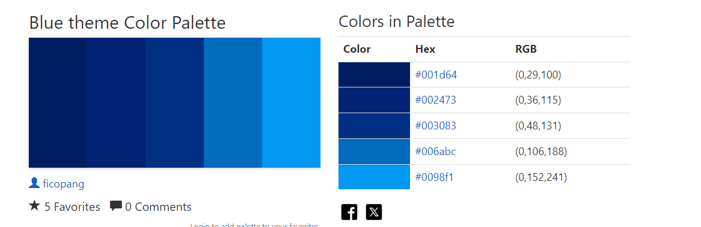

 ### Typography
<ul>
		<li>The primary font used on this website is roboto, sans-serif as fallback</li>
</ul>

### Wireframes
<ul>
    <li>Only pen & paper was used in the design of this project</li>
</ul>

## Technologies Used

<ul>
	<li>HTML5</li>
	<li>CSS3</li>
	<li>Javascript</li>
</ul>

## Frameworks, libraries & programs used
<ul>
	<li>gitpod</li>
	to write the code
	<li>git</li>
    for version controll
	<li>github</li>
	deployment of website and stories files online
	<li>google fonts</li>
    import main font of the website
	<li>font-awesome</li>
	import (fav)icons to the website
	<li>amiresponsive</li>
	Mockup picture for the README file
</ul>

## Testing

HTML -  no errors were returned when passing the site through the official [The W3C HTML validator](https://validator.w3.org) 

CSS - no errors were returned when passing the site through the official [The W3C CSS validator (jigsaw)](https://jigsaw.w3.org/css-validator/)

JS - no errors were returned when passing the site through the official [The JSHint Javascript validator](https://jshint.com)
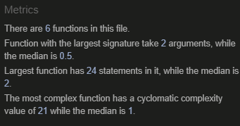

### Manual testing
<ul>
<li>The website has been tested on Opera browsers, Microsoft Edge and Google Chrome</li>
<li>Clicked on each button to see if they work correctly</li>
<li>clicking on each button to see if they work, expected result: button displayed
<li>The website has been viewed on a desktop computer, laptop and the Iphone 12 pro mobile phone</li>
<li>Testing has been done to ensure that links internally & externally work as intended</li>
<li>Family and friends have been asked to review the website in order to assure that user experience is satisfactory</li>
<li>Opera dev tools have been used to ensure the website looks suitable on various screen sized</li>
<li>Family & friends have been asked to review the website's readability and contrast</li>
</ul>

### Bugs

#### Solved Bugs
<ul>
<li>When the project was in development, none of the javascript would be applies to the pages</li>
<li>This was fixes by including the  tag at the bottom of the body.</li>
<li>When the win condition was met, none of the scores would be reset when clicking the restart button</li>
<li>This was resolved by directly resetting the variable responsible for displaying the scores instead of resetting the score incrementer</li>
</ul>

#### Unsolved bugs
<ul>
<li>There are no known issues at the time of submitting this project.</li>
</ul>

## Accesability

### Lighthouse report

#### Mobile analysis

Home page

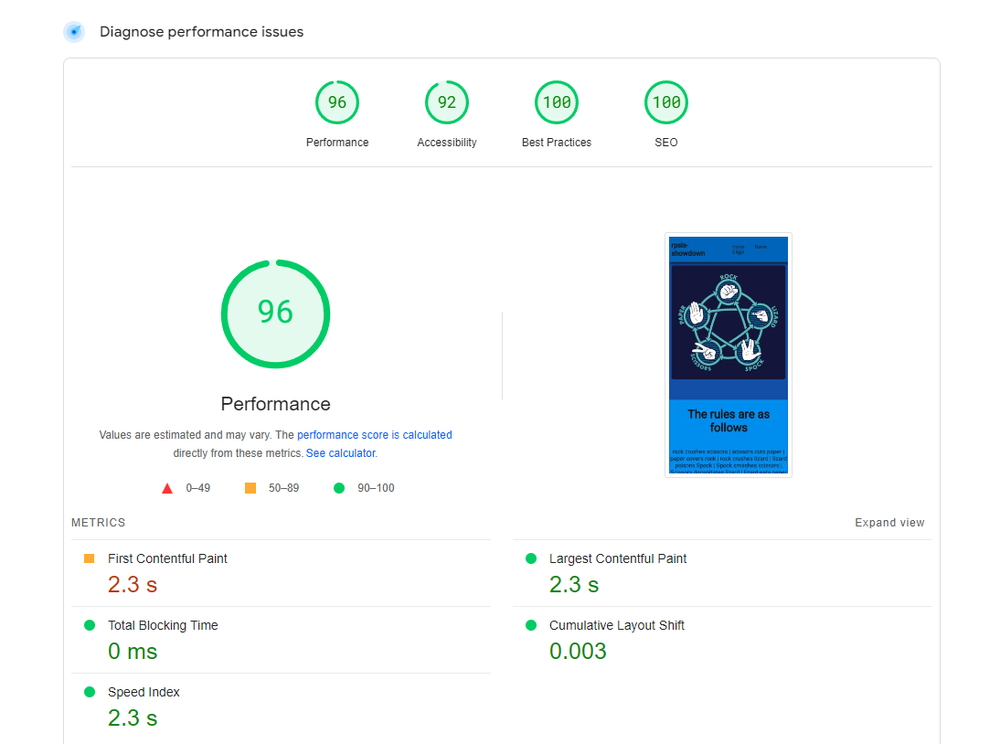

Game page

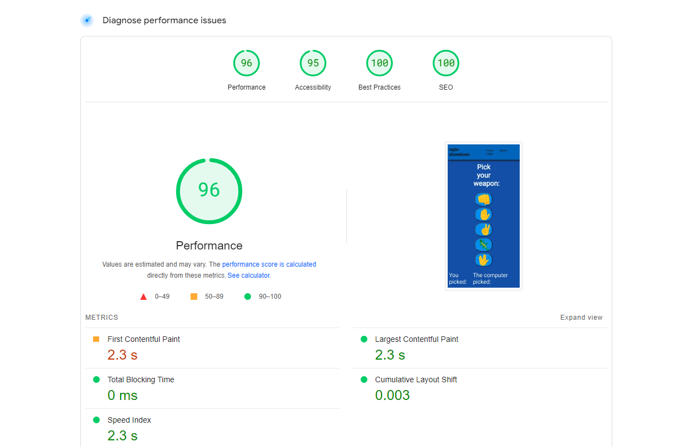

Origin page

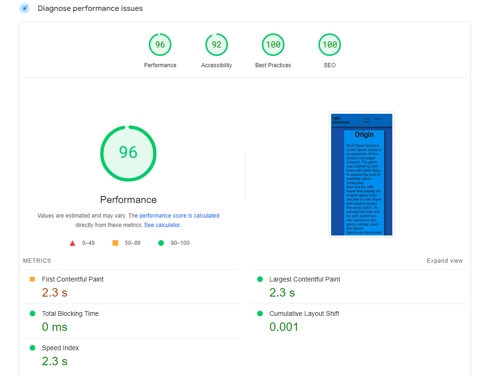

#### Desktop analysis

Home Page

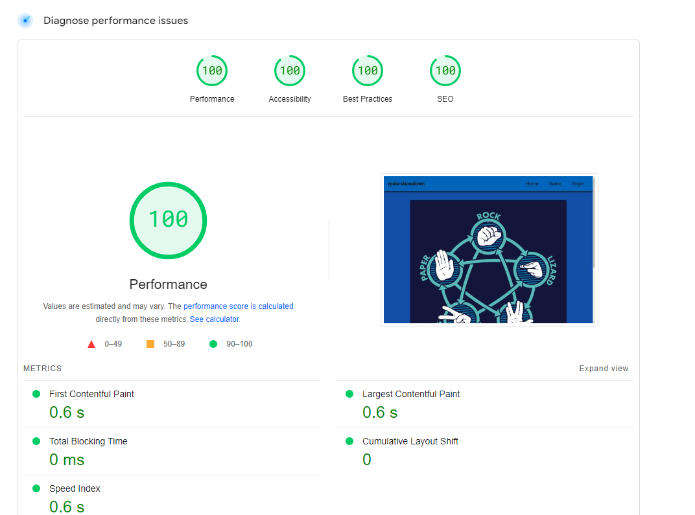

Game page

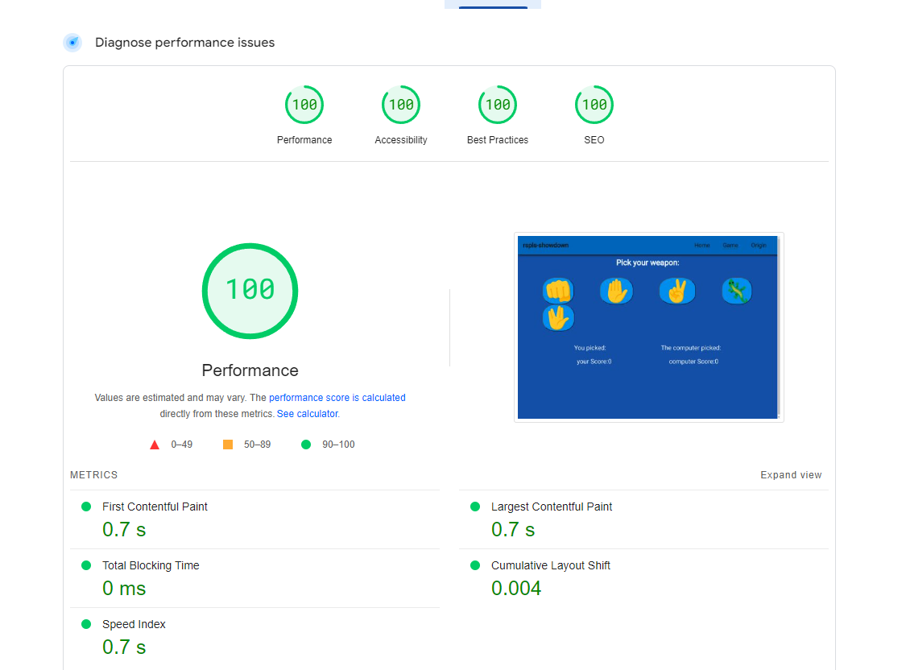

Sign Up

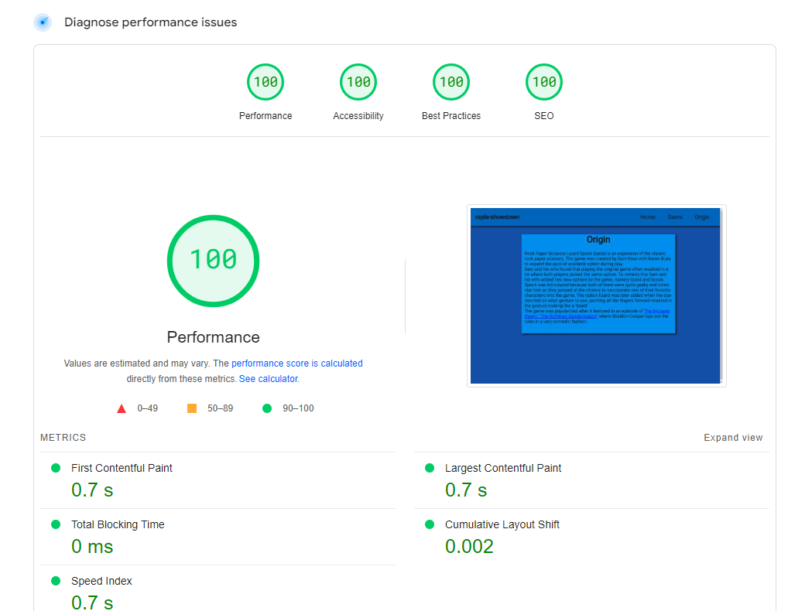

	
## Deployment and local development

### GitHub Pages

GitHub Pages used to deploy live version of the website.
1. Log in to GitHub and locate [GitHub Repository RPSLS-showdown](github.com/rasm1/RPSLS-showdown)
2. At the top of the Repository(not the main navigation) locate "Settings" button on the menu.
3. Scroll down the Settings page until you locate "GitHub Pages".
4. Under "Source", click the dropdown menu "None" and select "Main" and click "Save".
5. The page will automatically refresh.
6. Scroll back to locate the now-published site [link](https://rasm1.github.io/RPSLS-showdown/index.html) in the "GitHub Pages" section.

### Forking the GitHub Repository

By forking the repository, we make a copy of the original repository on our GitHub account to view and change without affecting the original repository by using these steps:

1. Log in to GitHub and locate [GitHub Repository RPSLS-showdown](https://github.com/rasm1/RPSLS-showdown)
2. At the top of the Repository(under the main navigation) locate "Fork" button.
3. Now you should have a copy of the original repository in your GitHub account.

### Local Clone

1. Log in to GitHub and locate [GitHub Repository RPSLS-showdown](github.com/rasm1/RPSLS-showdown)
2. Under the repository name click "Clone or download"
3. Click on the code button, select clone with HTTPS, SSH or GitHub CLI and copy the link shown.
4. Open Git Bash
5. Change the current working directory to the location where you want the cloned directory to be made.
6. Type `git clone` and then paste The URL copied in the step 3.
7. Press Enter and your local clone will be created.

## Credits

### Code
 * Code Institute's Love Maths project served very well as an example project
 * Understanding the concept of flexbox was learned through [Complete Guide to Flexbox](https://css-tricks.com/snippets/css/a-guide-to-flexbox/)
 * The README template was helpfully provided by [Code Institute (template)](https://github.com/Code-Institute-Solutions/SampleREADME)
 * This README was inspired by the README of [Thomas Tomo Lunar Escape](https://github.com/Thomas-Tomo/Lunar-Escape)
 * Bro Code provided a helpful example [https://www.youtube.com/@BroCodez]

### Content

 * All Homepage text content was generated by [Chatgpt](https://chat.openai.com)
 * RPSLS was made by Sam Kass and his wife Karen Bryla

### Media 
 * [wikipedia](https://nl.wikipedia.org/wiki/Hoofdpagina) free images.
 * [Google](https://www.google.com) Free images.

## Acknowledgements

 * My mentor Mitko Bachvarov provided me with ample feedback, idea's and support during the development of this project.
 * My brother  [Tim Ras](https://github.com/TimRas) for supporting me during the making of this project.